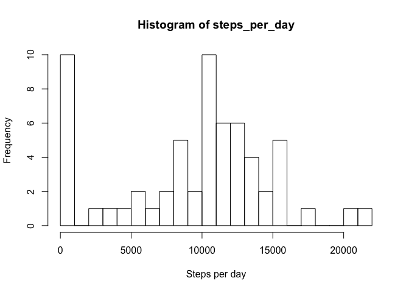
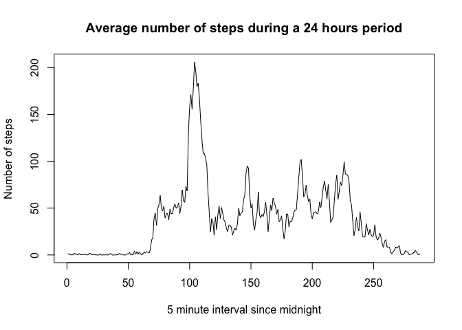
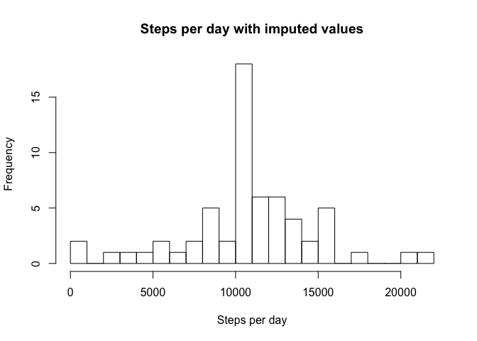
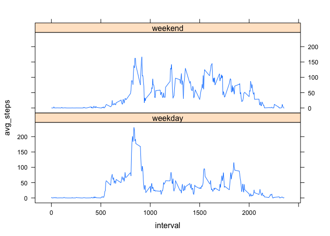

## Purpose of the document
This is an assignment from the course on Reproducible Research from John Hopkins University. It deals with an activity data set from a single individual possessing a fitness tracker.

The tracker, presumably worn at all times during the experiment, measures the number of steps taken by the individual. The data consists of the registered number of steps in each 5 minute interval during a two month period, namely October and November of the year 2012. There are 61 days in this period, hence the data contains $61\cdot 24\cdot 12 = 17568$ observations.

We perform an explorative data analysis in R and document the results using knitr. 

### Setting up global stuff 
In this section I am including various packages and setting up global settings. Note that I have turned off messages in the following chunk, ignoring the information about any masking of objects.

```r
## For data manipulation
library(dplyr)
## For graphics
library(lattice)
```


## Loading and preprocessing the data
We assume that the data from the fitness tracker has been unzipped in the local directory. We read the data and assess the structure.

```r
activity <- read.csv("activity.csv")
str(activity)
```

```
## 'data.frame':	17568 obs. of  3 variables:
##  $ steps   : int  NA NA NA NA NA NA NA NA NA NA ...
##  $ date    : Factor w/ 61 levels "2012-10-01","2012-10-02",..: 1 1 1 1 1 1 1 1 1 1 ...
##  $ interval: int  0 5 10 15 20 25 30 35 40 45 ...
```

### Understanding the data
There are three variables in the data "steps", "date", and "interval". The purpose of this section is to understand each variable a little better.

- steps is the registered number of steps in a given time interval. It is either a number or NA.
- date is a string denoting the date of the measurement in the format "yyy-mm-dd", i.e. "2012-10-23".
- interval is a integer encoding the time of day of the measurement. If it is two digits, it is the 5-minute interval after midnight, i.e. 25 denotes the measurement 25 minutes after midnight. If it is three digits, the first denotes the hour after midnight, i.e. 745 is the measurement at 45 minutes past 7. Similary for 4 digits.

## What is mean total number of steps taken per day?
We calculate the total number of steps taken each day. We remove the missing observations, essentially interpreting them as 0 steps in the given interval.

```r
steps_per_day <- tapply(activity$steps, activity$date, sum, na.rm=TRUE)
```
There are 61 days with measurements (including the NA. For instance the first day have nothing but NA as steps). How are the total number of steps per day distributed? To get a sense of this, we plot a histogram after having experimented with a proper number of bins and calculate the summary statistics, including the mean and the median.


```r
summary(steps_per_day)
```

```
##    Min. 1st Qu.  Median    Mean 3rd Qu.    Max. 
##       0    6778   10395    9354   12811   21194
```

```r
hist(steps_per_day, breaks=20,
     xlab="Steps per day")
```

<!-- -->
  
  We see the distribution is bimodal with a large peak around zero and another around 10.000.
  The mean is somewhat smaller than the median due to the large number of steps close to 0.
It seems unlikely that a normal person would take so few steps in a day unless hospitalized or similar. Hence it is probably the NAs being interpreted as 0. We will investigate this in a later section.


## What is the average daily activity pattern?
Since a person is sleeping at least some of the time we expect that the activity is not evenly distributed across time intervals.
Let us investigate this.

We plot the average number of steps in each time interval over all 61 days as a time series. There are $24\cdot 12=288$ intervals.


```r
avg_steps_per_interval <- tapply(activity$steps, activity$interval, mean, na.rm=TRUE)
plot(1:288, as.vector(avg_steps_per_interval), type='l', 
     main = "Average number of steps during a 24 hours period", 
     ylab='Number of steps', xlab="5 minute interval since midnight")
```

<!-- -->


I have used the sequence, since we can't just use the names of the intervals as x-values in the plot, because they are not equidistant, i.e. the intervals "450", "455" and "500" are each 5 minutes apart from each other, but numerically the distance between the first pair is 5, whereas it is 45 for the latter pair.

Just as suspected. The activity varies a lot during the day. It peaks around morning with some activity during the day. Let us find the precise time intervals.

```r
max_steps<-max(avg_steps_per_interval)
print(max_steps)
```

```
## [1] 206.1698
```

```r
which(avg_steps_per_interval == max_steps)
```

```
## 835 
## 104
```
Note that which returns the index, 104, corresponding to the max whereas "835" is the name of the index, i.e. the time interval. So the maximal aveverage number of steps is 206 and is attained between 8.35 and 8.40 in the morning. Let us see when the activity is above 90 steps.

```r
which(avg_steps_per_interval > 90)
```

```
##  810  815  820  825  830  835  840  845  850  855  900  905  910  915  920 
##   99  100  101  102  103  104  105  106  107  108  109  110  111  112  113 
##  925 1210 1215 1545 1550 1845 
##  114  147  148  190  191  226
```
We note that there are three smaller bursts of activity at around 12.10, 15.45 and 18.45. The lowest activity (close to zero steps) is late at night.


## Imputing missing values

We have already noted the large number of missing values. Let us discuss the matter further and determine the fraction of missing measurements.

```r
sum(is.na(activity$steps))/nrow(activity)
```

```
## [1] 0.1311475
```
13% is a pretty big number. Is it due to the person not wearing the device at certain times? Lets see how many days consists of nothing but missing values. We do that by using the apply functions. First we construct an array where each column corresponds to a date and each element is whether the steps are na. Then we use R's function "prod" coercion of TRUE and FALSE to 1 and 0 respectivly. If the product of all elements in a column of missing_days is 1, it is because is.na is true for all of the elements and hence each and everyone was missing.

```r
missing_days <- tapply(activity$steps, activity$date, is.na)
md <- sapply(missing_days, prod)
which(md == 1)
```

```
## 2012-10-01 2012-10-08 2012-11-01 2012-11-04 2012-11-09 2012-11-10 
##          1          8         32         35         40         41 
## 2012-11-14 2012-11-30 
##         45         61
```
8 total days of nothing but NA steps. That actually makes up all of the missing values, since $8/61 = 0.1311475$ which were the fraction of NAs.


The presence of missing days may introduce bias into some calculations or summaries of the data. 

Since we know very little about how the device works and the daily life of the individual in the experiment we use a very simple strategy for imputing the missing measurements, i.e. we simply use the observed mean per time interval for those days which do have measurements.

We make a copy of the dataset with the mean measurements in place of the missing values. We have already identified the dates with the missing values, i.e. where the vector md is 1, so we simply assign the average measurements to the steps column where the row indices corresponds to the correct date.

As a sanity check we find the number of NAs before and after the operation.


```r
activity_iv <- activity
sum(is.na(activity_iv$steps))
```

```
## [1] 2304
```

```r
for (d in names(md[md==1])){
    indices <- which(activity$date == d)
    activity_iv[indices,1] <- as.vector(avg_steps_per_interval)
}
sum(is.na(activity_iv$steps))
```

```
## [1] 0
```

Since the large number of missing values were previously interpreted as zero steps when calculating the total number of steps per day, we expect the imputed values to change the distribution of the activity.


```r
steps_per_day_iv <- tapply(activity_iv$steps, activity_iv$date, sum, na.rm=TRUE)
summary(steps_per_day_iv)
```

```
##    Min. 1st Qu.  Median    Mean 3rd Qu.    Max. 
##      41    9819   10766   10766   12811   21194
```

```r
hist(steps_per_day_iv, breaks=20,
     main="Steps per day with imputed values",
     xlab="Steps per day")
```

<!-- -->

Since the NAs have been replaced by the imputed values which are positive, the mean is now larger and the average number of steps is now estimated as 10.766. Furthermore the distribution is no longer skewed to the left. 

## Are there differences in activity patterns between weekdays and weekends?
In order to answer this question we define a new factor taking on two levels "weekend" and "weekday" depending on whether the date of the measurements were either a saturday or a sunday or a normal weekday.
We can use R's built in Date functions to accomplish this.

```r
activity_iv$weekday <- "Unknown"

## I have some trouble setting date time correctly
## Therefore I get some warnings about time zones in the output from knitr.
## They don't appear to be relevant so I suppress warnings temporarily.
warn_n <- getOption("warn")
options(warn = -1)

## I simply loop through all the dates and determine whether it is
## a weekday or a weekend. 
for (i in 1:length(activity_iv$weekday)){
    day <- weekdays(as.Date(activity_iv$date[i], format="%Y-%m-%d"))
    if (day == "Saturday" || day == "Sunday"){
        activity_iv$weekday[i] <- "weekend"
    }
    else {
        activity_iv$weekday[i] <- "weekday"
    }
}
## Return warnings to the normal setting
options(warn = warn_n)
```

Let us examine whether the average activity across time intervals is different on weekends. It turns out that the dplyr package provide very convinient filter methods which are easy to understand. For instance we can group the data by interval and the new factor weekday and then take the average number of steps in each group. We save the results in a new dataframe.

```r
activity_iv %>% group_by(interval, weekday) %>% 
    summarise(avg_steps = mean(steps)) -> df
head(df)
```

```
## # A tibble: 6 x 3
## # Groups:   interval [3]
##   interval weekday  avg_steps
##      <int>   <chr>      <dbl>
## 1        0 weekday 2.25115304
## 2        0 weekend 0.21462264
## 3        5 weekday 0.44528302
## 4        5 weekend 0.04245283
## 5       10 weekday 0.17316562
## 6       10 weekend 0.01650943
```
The lattice package can make scatterplots across panels where each panel correponds to a level of a factor. We use this to depict the average number of steps for each time interval grouped by the two level factor weekday. For easier comparison we set the panels atop each other with the layout option.

```r
xyplot(avg_steps ~ interval | weekday, data=df,
       type="l",
       layout=c(1,2) )
```

<!-- -->


We note that while both plots show the peak of activity at the same time in the morning, the number of steps during the day is much higher on the weekend.
